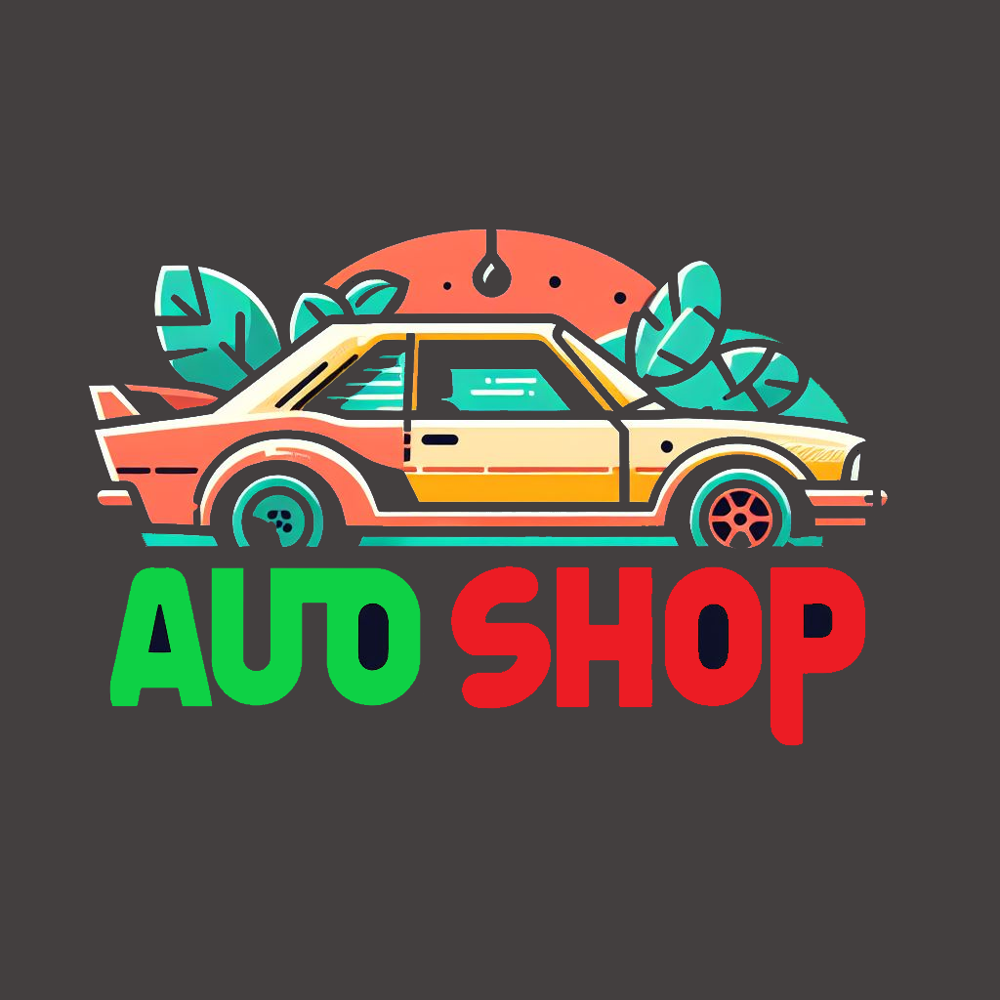
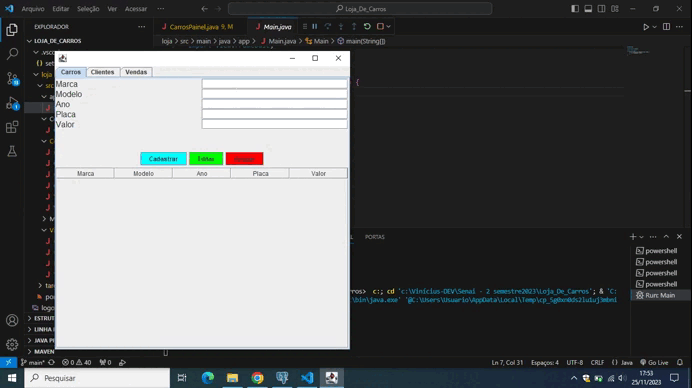
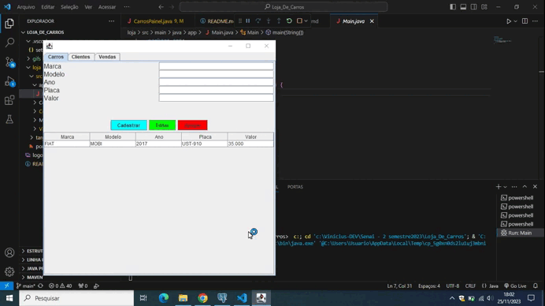
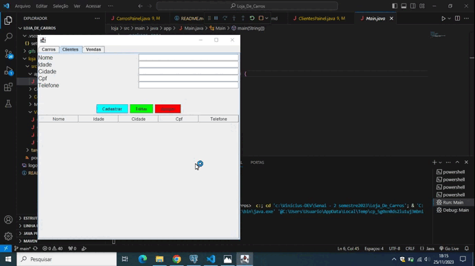
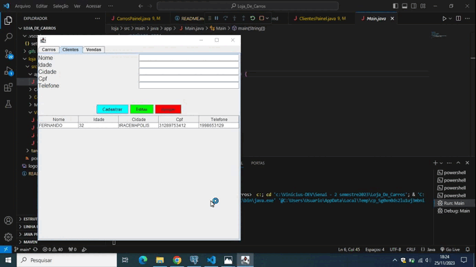
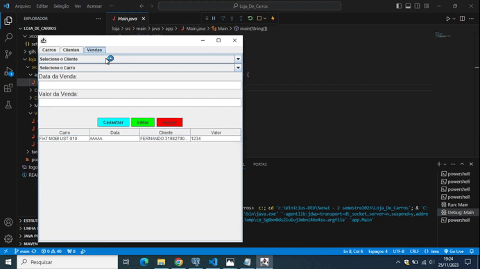

 
 
 

   

    
   
 

 
   

   </a>
   

      <h4>Seja bem-vindo(a) à documentação deste projeto. Aqui estará o funcionamento da loja de carros feita com GUI (Graphic User Interface) e JDBC (Java Database Connection) utilizando PostgresSQL para o banco de dados. O meu notebook é um pouco antigo e por isso os gifs não ficaram com uma qualidade muito boa, mas é isso.</h4>
   

      

   </a>
   

      <h3>Cadastrando o carro</h3>
     
         
      <h3>Editando alguma informação caso tenha errado</h3>
      
         
      <h3>Apagando o cadastro do carro</h3>
      
         
   

   

   </a>
   

      <h3>Cadastrando o cliente</h3>
     
         
      <h3>Editando alguma informação caso tenha errado</h3>
      
         
      <h3>Apagando o cadastro do cliente</h3>
      
         
   

   

   </a>
   

      <h3>Registrando uma venda usando JComboBox</h3>
     
         
   

   

   </a>
   

    será feito amanhã
   

   
